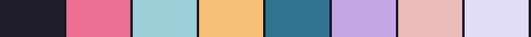

<table>
<tr>
<td valign="middle" width="200" align="center">

</td>
<td valign="middle">

**Randy Ren** — [github.com/randyren278](https://github.com/randyren278)

<pre>
randyren278@github
──────────────────────────────────────
Role........ Student @ UBC · ex-intern @ SAP, Visa
Focus....... AI agents — context engineering, harnesses, tool use
Editor....... VS Code
Site......... <a href="https://www.randyren.org/">randyren.org</a>

GitHub Stats — synced daily via Actions ─────────
Commits...... 

</pre>

*"Making agents feel like real collaborators — the kind you'd actually want to work with, not the kind that eats your afternoon."* — [randyren.org](https://www.randyren.org/)

</td>
</tr>
</table>
